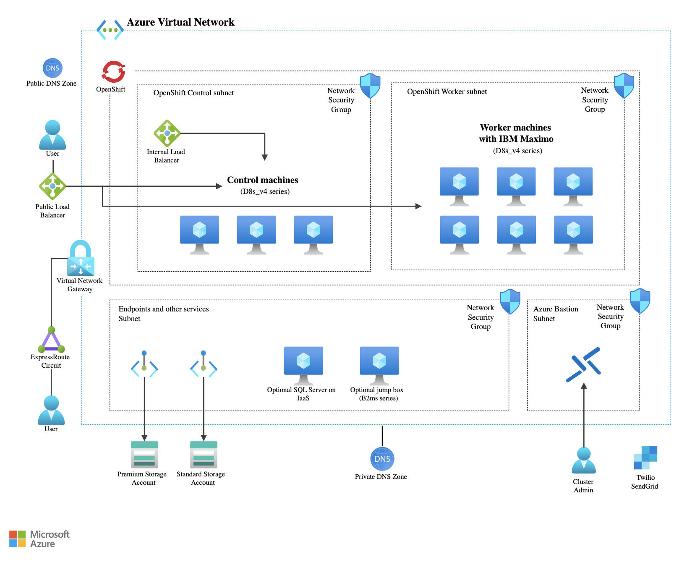
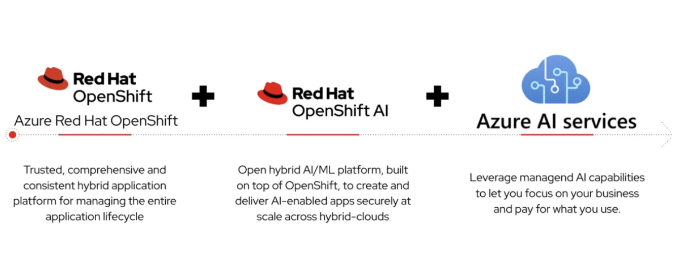
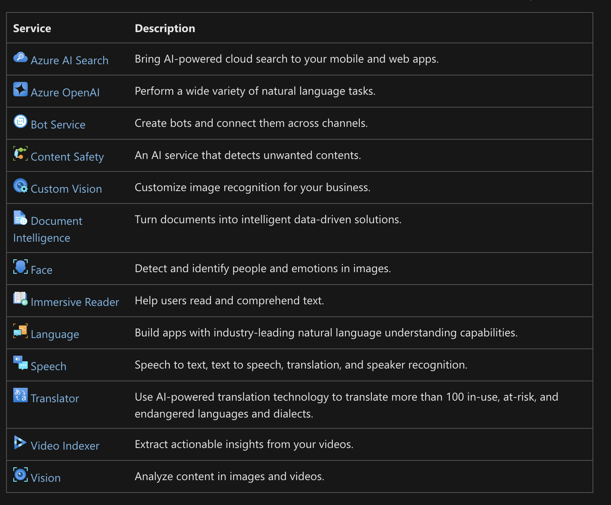

# Azure Red Hat Openshift ARO Public Links Document
#by Andrew Grimes, this is my own effort and unnofficial 
#These are links to help with documentation and resources for the joint Red Had and Microsoft Azure managed service based on OpenShift. 

Microsoft and Red Hat "Turnkey" Application Platform 

    
  <em> 
  </em>

**Azure and Red Hat Resources**

Azure Red Hat OpenShift Main Resource Page
Comprehensive List of resources for Storage, Install, Security, Scaling and DR etc. 
https://www.redhat.com/en/technologies/cloud-computing/openshift/azure/learn

Azure Red Hat OpenShift Azure Public Training      
https://learn.microsoft.com/en-us/training/modules/introduction-to-azure-red-hat-openshift/

Full Azure Red Hat Openshift (ARO) Video Series     
https://www.youtube.com/playlist?list=PLaR6Rq6Z4IqcY-4O8VTy_a68uG_aXdxBK

Latest Blogs and Workshop Recordings        
Azure AI on ARO workshop Blog Series 11/12/24      
https://www.redhat.com/en/blog/accelerating-ai-driven-solutions-azure-red-hat-openshift

AI on ARO session from Ignite Recording 11/19/24
[https://ignite.microsoft.com/en-US/sessions/THRFP760?source=sessions](https://ignite.microsoft.com/en-US/sessions/ODFP971?source=/speakers/7b2a6cdc-4539-4998-a078-a2b5742d2286)

OpenAI, ChatGPT, RHOAI on ARO blog by desari 12/4/24
https://cloud.redhat.com/experts/rhoai/aro-rag/

Azure Red Hat OpenShift Public Inference Workshop with Resnet50 

    
  <em> 
  </em>

https://github.com/emcon33/inference-aro-workshop                  
https://github.com/emcon33/inference-aro-frontend

Webinar IBM Software Modernization on ARO Webinar recording. 10/29/24
https://www.youtube.com/watch?v=lJsamfisK8c

Next Workshop Virtual Invitations for North America 
TBS

General ARO Content      

Azure ARO overview Video short      
https://www.youtube.com/watch?v=H6PTZ6OXjkE

Azure ARO Workloads (AI, Cloud Pak(s), NVIDIA) 
https://www.youtube.com/watch?v=jdMwmWiMOFU

Azure ARO overview Video
https://www.youtube.com/watch?v=OQuikb8VcTY

Azure ARO Learning Path 
https://www.redhat.com/en/products/interactive-walkthrough/deploy-microsoft-azure-red-hat-openShift

Azure and Red Hat presenting ARO at OpenShift Commons (video)
https://www.youtube.com/watch?v=8f7eoA4xW6Y

Azure Red Hat OpenShift Refreshed Deck 2024 (internal) 
https://docs.google.com/presentation/d/1J9ycw3u2Xo8PdUOMu0eLxSxzUuKPNP-GiM0uBUbyIQA/edit#slide=id.p1

ARO RHPDS Demo: (internal) https://demo.redhat.com/catalog?item=babylon-catalog-prod/azure-gpte.open-environment-aro4-sub.prod&utm_source=webapp&utm_medium=share-link

ARO FAQ
https://learn.microsoft.com/en-us/azure/openshift/openshift-faq

Azure ARO Analyst Paper
https://www.redhat.com/en/engage/forrester-microsoft-azure-openshift-value-analyst-material

Internal Red Hat Resource page (internal link) 
https://content.redhat.com/us/en/sales-enablement/sales-plays-overview/salesplay-openshift/salestactic-openshift-cloud-services.html#tabs-91412d45a3-item-53952adf7c-tab

**ARO Azure Resources **

Azure Sizer for Pricing supports ARO: 

    
  <em> 
  </em>

Public ARO Pricing Calculator (export as xls and save as a link) 
https://azure.microsoft.com/en-us/pricing/calculator/

Public ARO Public Pricing per hour per instance type 
https://azure.microsoft.com/en-us/pricing/details/openshift/

Internal Red Hat Sizing on ARO	(Internal RH)        
https://docs.google.com/document/d/1V7ENV5mu6wruU8ToNe_Q1Y9fLx0dsKXm412AoRkAJTQ/edit?tab=t.0

Internal Doc Buying ARO RI's (Internal RH) 	      
https://docs.google.com/document/d/1_4tygeY21iPTUHGiwpPzOILJVDv7GBB2z630G8P462g/edit?tab=t.0

Internal Late Quarter Booking Credit Process ARO (Internal RH) 	       
https://docs.google.com/document/d/1jHFaPQsLqHm6JGkcEppWt-0FZ7SYNTUDHYT5qyFulSQ/edit?tab=t.0

ARO Cost Optimization (video)
https://www.youtube.com/watch?v=nl3whsKMdnE&t=76s

ARO Level Up (POC Program) external
http://red.ht/Level-Up

ARO Level up POC Program (internal)
https://source.redhat.com/groups/public/crosssellupsell/level_up_openshift/level_up_cloud_services

ARO Managed OpenShift Black Belt Workshop (MOBB)
https://microsoft.github.io/aroworkshop/

ARO Image Classification App
https://github.com/emcon33/inference-aro-workshop

Azure ARO for Financial Services 
https://learn.microsoft.com/en-us/azure/architecture/reference-architectures/containers/aro/azure-redhat-openshift-financial-services-workloads

Forrester TEI Study for Hybrid Cloud Services
https://www.redhat.com/en/resources/forrester-microsoft-azure-openshift-value-analyst-material

ARO Interactive Walkthrough
https://www.redhat.com/en/products/interactive-walkthrough/deploy-microsoft-azure-red-hat-openShift

Ansible on ARO demo Video 
https://www.youtube.com/watch?v=PqiTE5Uh3Jk

ARO ACO details
https://learn.microsoft.com/en-us/partner-center/billing/azure-credit-offer-balance

**ARO Workshops 
MOBB ARO Workshop: https://microsoft.github.io/aroworkshop/

RHPD Lab Parasol on RHOAI/ARO (Internal) 
https://demo.redhat.com/catalog?item=babylon-catalog-prod/azure-gpte.ocp4-rhoai-aro-parasol.prod&utm_source=webapp&utm_medium=share-link

Parasol RHOAI/ARO MOBB Workshop: https://github.com/rh-mobb/parasol-insurance/tree/azure-build

Parasol RHOAI/ARO workshop Walk Through : https://rh-aiservices-bu.github.io/parasol-insurance/modules/index.html

OpenShift AI and Podman AI Lab workshop. 
https://github.com/redhat-ai-services/podman-ai-lab-to-rhoai

**ARO References **

Public Microsoft ARO References (Microsoft site) 
https://customers.microsoft.com/en-us/search?sq=%22Azure%20red%20hat%20openshift%22&ff=&p=2&so=story_publish_date%20desc

Ortec Finance ARO/RHOAI Reference (Microsoft site) 
https://customers.microsoft.com/en-us/story/1485727667262024367-ortec-finance-cloud-native-platform-azure-red-hat-openshift

Ortec Finance ARO Video
https://www.youtube.com/watch?v=5UBy-l0Vemk

Symend Azure AI and ARO reference (Microsoft Site) 
https://customers.microsoft.com/en-ca/story/1772332670120262733-symend-azure-machine-learning-professional-services-en-canada

Vinci Energies ARO Reference (Microsoft Site)
https://customers.microsoft.com/en-us/story/1340822776599403898-vinci-energies-energy-microsoft365-en-netherlands

Mitsubishi Heavy Industries (Microsoft) 
https://customers.microsoft.com/en-us/story/1623265179718411934-mitsubishi-heavy-industries-ltd-discrete-manufacturing-azure-en-japan

Nationwide Building Society (Microsoft)
https://customers.microsoft.com/en-us/story/1517814340865545424-nationwide

Liberty Investments (Microsoft) 
https://customers.microsoft.com/en-us/story/1418994276518154390-liberty-insurance-microsoft365-en-south-africa

Bradesco OpenShift Commons Case Study (RH Video)
https://www.youtube.com/watch?v=PTo2soO20Fs

Vodafone ARO Reference (RH Site)
https://www.redhat.com/en/about/videos/vodafone-nz-deploys-redhat-solutions

Suncorp ARO Reference (RH Site)
https://www.redhat.com/rhdc/managed-files/rh-suncorp-case-study-322881pr-202309-en.pdf

Yes Bank ARO Reference (RH Site) 
https://www.redhat.com/en/about/press-releases/yes-bank-collaborates-red-hat-redefine-mobile-banking-experience-its-customers

Groupo Pinero ARO Reference (RH Site)
https://www.youtube.com/watch?v=s9hJfu8_mG8

Novoblanko ARO Reference (RH Site)
https://www.redhat.com/en/resources/novobanco-case-study

Exxon ARO Reference (RH Site) 
https://www.redhat.com/en/about/press-releases/red-hat-details-benefits-energy-customer-after-migrating-workloads-hybrid-cloud-infrastructure

Advanced Auto Parts using Managed OpenShift ARO OpenShift Commons Session 
https://www.youtube.com/watch?v=2UDF4UHyZAw

Campari ARO reference IBM Consulting (IBM site) 
https://www.ibm.com/case-studies/campari-group

Adobe Watsonx.ai strategy with OpenShift (ARO).... 
https://blog.adobe.com/en/publish/2024/05/21/generative-ai-brings-new-opportunities-adobes-partnership-with-ibm

IBM Consulting and ARO
https://www.ibm.com/blog/better-together-ibm-and-microsoft-make-enterprise-wide-transformation-a-reality/

References (Internal) 
https://docs.google.com/spreadsheets/d/1_AZ4f_8DJt8NrSsJctnYzoCEPg7FY3BRq9lkF6us_l8/edit?gid=0#gid=0

**ARO Documentation **

ARO Azure Documentation: 
https://learn.microsoft.com/en-us/azure/openshift/

Support Responsibilities: 
Customer Support Matrix: https://learn.microsoft.com/en-us/azure/openshift/responsibility-matrix

ARO supported versions of OCP
https://learn.microsoft.com/en-us/azure/openshift/support-lifecycle

ARO supported worker types Lifecycle
https://learn.microsoft.com/en-us/azure/openshift/support-policies-v4

ARO Architecture: Azure Site
https://techcommunity.microsoft.com/t5/fasttrack-for-azure/azure-red-hat-openshift-reference-architecture-amp-reference/ba-p/3470115

ARO SLA and Service Description
"Azure Red Hat OpenShift offers a Service Level Agreement to guarantee that the service will be available 99.95% of the time." 
https://www.microsoft.com/licensing/docs/view/Service-Level-Agreements-SLA-for-Online-Services?lang=1

ARO Network: Azure site
https://learn.microsoft.com/en-us/azure/openshift/concepts-networking

ARO GPU configuration
https://learn.microsoft.com/en-us/azure/openshift/howto-gpu-workloads

Specific ARO Reference (Microsoft site) 
https://customers.microsoft.com/en-us/story/1485727667262024367-ortec-finance-cloud-native-platform-azure-red-hat-openshift

Microsoft Self Paced ARO (Microsoft site) 
https://www.redhat.com/en/products/interactive-walkthrough/deploy-microsoft-azure-red-hat-openShift

Ansible with ARO deployment video
https://www.youtube.com/watch?v=d701iQ2v2J0

Ansible with ARO Github: 
https://github.com/rh-mobb/ansible-aro

ARO deployment Video
Here is a quick, 4 min demo, of deploying an ARO cluster in the Azure portal: https://www.youtube.com/watch?v=iY66MONBfVQ&t=1s

ARO Cost Management
https://learn.microsoft.com/en-us/azure/cost-management-billing/reservations/prepay-red-hat-openshift#discount-applies-to-different-vm-sizes

**ARO Azure Integration **
Integrate ARO with Azure DevOps (Blog and Video) 
https://medium.com/@bshayr29/use-microsoft-azure-devops-pipeline-with-red-hat-openshift-282b85cb1737
https://www.youtube.com/watch?v=ugmY5DdErJ4

Integrate ARO with Azure DevOps annotated page 
https://cloud.redhat.com/learning/learn:microsoft-azure-red-hat-openshift-explained/resource/resources:devops-integration-microsoft-azure-red-hat-openshift

Integrate ARO with Azure DevOps (MOBB doc) 
https://cloud.redhat.com/experts/misc/azure-dev-ops-with-managed-openshift/

Azure Red Hat OpenShift Video Series
https://www.youtube.com/watch?v=H6PTZ6OXjkE&list=PLaR6Rq6Z4IqcY-4O8VTy_a68uG_aXdxBK

Azure ARO Compliance
https://azure.microsoft.com/mediahandler/files/resourcefiles/microsoft-azure-compliance-offerings/Microsoft%20Azure%20Compliance%20Offerings.pdf

Azure ARO Compliance
https://learn.microsoft.com/en-us/azure/azure-government/compliance/azure-services-in-fedramp-auditscope#terminology-used-1

Generative AI and ARO
https://www.redhat.com/en/blog/how-do-you-operationalize-generative-ai-consistently-and-scale

Deploy Java JBOSS EAP on ARO Video
https://learn.microsoft.com/en-us/azure/developer/java/ee/jboss-eap-on-aro
https://www.youtube.com/watch?v=HE2t9PIaymE
https://www.youtube.com/watch?v=k1xP37agUpM

Azure ARO Training 
https://learn.microsoft.com/en-us/training/modules/introduction-to-red-hat-azure/

Terraforming ARO with Github Actions 
https://www.redhat.com/en/blog/terraforming-azure-red-hat-openshift-aro-with-github-actions

**IBM Software Modernization on ARO Resoures **

IBM Software on ARO: 

    
  <em> 
  </em>

General Public Blog on Cloud Pak on Azure Red Hat OpenShift (ARO)
https://medium.com/@aliboyraz/requirements-for-installing-ibm-cloud-pak-on-azure-redhat-openshift-aro-95c384456d16

Public IBM Support Matrix 
https://www.ibm.com/software/reports/compatibility/clarity/softwareReqsForProduct.html
https://www.ibm.com/support/pages/node/6592835

Public IBM Software Support Matrix (Maximo Example) Select IBM Maximo, Version 8.11 and Containers. Then Submit, ARO is under the container tab https://www.ibm.com/software/reports/compatibility/clarity/softwareReqsForProduct.html

Internal IBM Sofware on Azure Red Hat OpenShift Support Marix (Inernal Red Hat XLS) 
https://docs.google.com/spreadsheets/d/1E5ndWx_TtRBNAyINqefZK9xt-G2XGWWNwti5bCGLDNY/edit#gid=1114692282

IBM Maximo (MAS) Content    

Maximo MAS on ARO Reference Architecture 

    
  <em> 
  </em>

Maximo on ARO Quick Azure Branded Documentation         
https://learn.microsoft.com/en-us/azure/architecture/example-scenario/apps/deploy-ibm-maximo-application-suite

IBM and Microsoft Blog on Why Maximo on ARO (Microsoft Version)       
https://techcommunity.microsoft.com/t5/azure-migration-and/ibm-maximo-application-suite-migration-and-modernization-with/ba-p/4123838

IBM, RH and Microsoft Blog on why Maximo on ARO (IBM Version) 
https://www.ibm.com/blog/maximo-application-suite-migration-and-modernization-with-red-hat-openshift-on-azure/

IBM Maximo Reference Architecture for Use Cases from IBM 
https://ibm.github.io/intelligent-asset-reference-architecture/Overview/

Value of Maximo on Azure (ARO) pdf
https://www.ibm.com/downloads/cas/K5YQ9YOR

IBM Maximo MAS
Maximo on ARO - Microsoft blog
https://learn.microsoft.com/en-us/azure/architecture/example-scenario/apps/deploy-ibm-maximo-application-suite

Maximo on ARO - Microsoft blog implementation 
https://techcommunity.microsoft.com/t5/azure-migration-and/ibm-maximo-application-suite-migration-and-modernization-with/ba-p/4123838#:~:text=MAS%20provides%20organizations%20with%20a,deploying%2C%20running%20and%20managing%20applications.

Maximo on ARO IBM blog
https://community.ibm.com/community/user/asset-facilities/blogs/sudhir-jain/2023/12/01/mas-on-aro

Install Maximo on ARO by Ansible Playbook (Red Hat Documentation) 
https://cloud.redhat.com/experts/aro/mas/

Install Maximo on IBM Cloud (OCP) Video
https://www.youtube.com/watch?v=jdcJA7kDacI

IBM Maximo on ARO IBM Blog Details on Maximo
https://www.linkedin.com/pulse/ibm-maximo-azure-eduardo-ortega/

Maximo on Azure (self managed OCP) Listing 
https://azuremarketplace.microsoft.com/en-us/marketplace/apps/ibm-usa-ny-armonk-hq-6275750-ibmcloud-asperia.ibm_maximo_application_suite_client_managed?tab=Overview

Supported cluster sizes:
* Small: Master Nodes (Standard_D8s_v3 x 3) - vCPU:24 Memory:96GB | Worker Nodes (Standard_D16s_v3 x 3) - vCPU:48 Memory:192GB | Bootnode (Standard_D2s_v3 x 1) - vCPU:2 Memory:8GB
* Medium: Master Nodes (Standard_D8s_v3 x 3) - vCPU:24 Memory:96GB | Worker Nodes (Standard_D16s_v3 x 5) - vCPU:80 Memory:320GB | Bootnode (Standard_D2s_v3 x 1) - vCPU:2 Memory:8GB
* Large: Master Nodes (Standard_D8s_v3 x 5) - vCPU:40 Memory:160GB | Worker Nodes (Standard_D16s_v3 x 7) - vCPU:112 Memory:448GB | Bootnode (Standard_D2s_v3 x 1) - vCPU:2 Memory:8GB

Maximo on ARO MSFT Blog
https://techcommunity.microsoft.com/t5/azure-migration-and/ibm-maximo-application-suite-migration-and-modernization-with/ba-p/4123838

Maximo on Air Gapped ARO (air gapped ARO) 
https://community.ibm.com/community/user/asset-facilities/blogs/saurabh-rajguru/2024/02/27/mas-on-private-aro

Maximo integration with Azure IoT services 
https://medium.com/eamstream/azure-iot-integration-with-maximo-part-1-b141c4210db0

TCS GSI Offering for Maximo on Azure
https://azuremarketplace.microsoft.com/en-us/marketplace/consulting-services/tataconsultancyservices-iot.tcs_maximooncloud

Maximo on ARO support matrix from IBM. 
Select IBM Maximo, Version 8.11 and Containers. Then Submit, ARO is under the container tab
https://www.ibm.com/software/reports/compatibility/clarity/softwareReqsForProduct.html

IBM Tririga on ARO
https://azuremarketplace.microsoft.com/en-us/marketplace/apps/aad.ibmtririgaoncloud?tab=Overview

IBM CP4BA on Azure Red Hat Openshift partner video 
https://www.youtube.com/watch?v=i5kak-F_mPo

IBM CP4D on ARO
https://www.ibm.com/docs/en/cloud-paks/cp-data/5.0.x?topic=planning-cloud-deployment-environments
https://cp4dazuremarketplacedoc.blob.core.windows.net/ibmcp4dazuremarketplace/CP4D_MS_ARO_Deployment_Guide.pdf

IBM Watsonx 
Watsonx.ai on ARO (Blog) Microsoft 
https://www.ibm.com/blog/announcement/watsonx-on-microsoft-azure/

IBM Watsonx on Azure Sizing
https://developer.ibm.com/articles/awb-introducing-watsonx-ai-on-microsoft-azure/

Watsonx.ai on ARO Adobe (blog)  IBM
https://developer.ibm.com/articles/awb-introducing-watsonx-ai-on-microsoft-azure/

Watsonx.ai on ARO Reference Archtitecture 
https://developer.ibm.com/articles/awb-introducing-watsonx-ai-on-microsoft-azure/

Watsonx.ai on ARO 

    
  <em> 
  </em>

Watsonx.ai on OpenShift (ARO) IBM for Adobe
https://newsroom.ibm.com/Blog-Adobe-and-IBM-Transforming-Customer-Experiences-with-Personalization-at-Scale,-Powered-by-AI-and-Hybrid-Cloud-Innovation

Watsonx.governance on ARO with Azure AI Integration 

    
  <em> 
  </em>

IBM Watsonx.governance on ARO reference architecture
https://developer.ibm.com/articles/awb-watsonx-governance-responsible-transparent-explainable-ai/

IBM Watsonx.governance on Azure Marketplace
https://azuremarketplace.microsoft.com/en-us/marketplace/apps/ibm-usa-ny-armonk-hq-6275750-ibmcloud-asperia.watsonx-governance-ibm?tab=Overview&utm_source=ibm_developer&utm_content=in_content_link

Watsonx.data Install (ARO and Others 
https://www.ibm.com/docs/en/watsonx/watsonxdata/1.0.x?topic=cluster-installing-red-hat-openshift-container-platform

IBM CP4I 
CP4I on Azure with ARO
Blog:https://techcommunity.microsoft.com/t5/apps-on-azure-blog/ibm-cloud-pak-for-integration-on-azure-red-hat-openshift-now/ba-p/4180542

CP4I on Azure with ARO Marketplace:https://azuremarketplace.microsoft.com/en-us/marketplace/apps/ibm-usa-ny-armonk-hq-6275750-ibmcloud-asperia.ibm-cloud-pak-for-integration-aro-byol?tab=Overview

CP4I on ARO POC (dated)
https://rastogianshul85.medium.com/cp4i-part2-proof-of-concept-poc-learn-share-a756ca0f084f
https://rastogianshul85.medium.com/ibm-cloud-paks-for-integration-aka-cp4i-learni-part1-dffd71f7a739

IBM MQ on ARO value deck from IBM Consulting (internal) 
https://source.redhat.com/groups/public/anz_cots_collaborations/ocp_workloads~2/cots_workloads_for_openshift/ibm_mq_ace_odm_on_aro_cp4i_cp4ba

IBM CP4D
CP4D on ARO Marketplace Listing
https://azuremarketplace.microsoft.com/en-us/marketplace/apps/ibm-usa-ny-armonk-hq-6275750-ibmcloud-asperia.cloud-pak-for-data-ibm?tab=overview

IBM CP4D on ARO Video
https://video.ibm.com/recorded/128365440

Reference WW Internal
https://content.redhat.com/content/rhcc/us/en/assets/display.html?id=efd0f910-e05b-47a2-b510-c0611741d036

IBM Liberty Websphere on ARO IBM Documentation
https://www.ibm.com/docs/en/was-liberty/core?topic=container-running-websphere-liberty-microsoft-azure

IBM Liberty on ARO Azure  Documentation
https://learn.microsoft.com/en-us/azure/openshift/howto-deploy-java-liberty-app

IBM Liberty ARO listing Marketplace Listing https://azuremarketplace.microsoft.com/en-us/marketplace/apps/ibm-usa-ny-armonk-hq-6275750-ibmcloud-aiops.20210823-liberty-aro?tab=overview

IBM Governance on ARO Marketplace listing 
https://azuremarketplace.microsoft.com/en-us/marketplace/apps/ibm-usa-ny-armonk-hq-6275750-ibmcloud-asperia.ibm-data-governance-express-byol?tab=overview

IBM Guardium Insights on ARO
https://www.ibm.com/docs/en/guardium-insights/3.2.x?topic=scenarios-manual-installation-azure-aro

Installing CP4AIOps on ARO documentation 
https://www.ibm.com/docs/en/cloud-paks/cloud-pak-aiops/4.6.1?topic=platforms-installing-azure-red-hat-openshift
https://www.ibm.com/docs/en/cloud-paks/cloud-pak-aiops/4.8.0?topic=platforms-installing-aro

IBM Cloud Pak for Business Automation on ARO  CP4BA 
https://www.ibm.com/docs/en/cloud-paks/cp-biz-automation/23.0.1?topic=automation-planning
https://github.com/apollo-business-automation/ibm-cp4ba-demo-deployment
https://www.ibm.com/docs/en/cloud-paks/cp-biz-automation/23.0.1?topic=automation-installing

M2M ARO Pricing Discount (internal) 
https://docs.google.com/document/d/1T_DY3YTRVP5D6T9j4lK06bGzRyQ1unWb7mtV-R3di8o/edit

IBM Sterling on ARO
https://www.ibm.com/blog/announcement/introducing-ibm-sterling-order-management-on-microsoft-azure/

IBM Sterling OMS on ARO
Microsoft IBM Sterling OMS on ARO Documentation
https://learn.microsoft.com/en-us/azure/architecture/reference-architectures/ibm/deploy-ibm-sterling-oms

IBM Sterling OMS on ARO  Blog 
https://developer.ibm.com/tutorials/deploying-sterling-order-management-on-azure-red-hat-openshift/

IBM Sterling OMS on ARO Install Procedures 
https://github.com/Azure/sterling

IBM Webspere migrate to ARO
https://learn.microsoft.com/en-us/azure/developer/java/migration/migrate-websphere-to-azure-redhat-openshift?toc=%2Fazure%2Fdeveloper%2Fjava%2Fee%2Ftoc.json&bc=%2Fazure%2Fdeveloper%2Fjava%2Fbreadcrumb%2Ftoc.json

IBM Liberty/Websphere migrate to ARO
https://learn.microsoft.com/en-us/azure/developer/java/ee/liberty-on-aro?tabs=deploy-console

IBM ODF on Azure with ARO support
https://www.ibm.com/docs/en/announcements/spectrum-fusion-24?mhsrc=ibmsearch_a&mhq=IBM%20Azure%20Red%20Hat%20OpenShift%20Service

Artificial Intelligence on ARO Resources ******  

    
  <em> 
  </em>

Azure AI on ARO workshop Blog Series 11/12/24         
https://www.redhat.com/en/blog/accelerating-ai-driven-solutions-azure-red-hat-openshift

Generative AI and ARO Blog              
https://www.redhat.com/en/blog/how-do-you-operationalize-generative-ai-consistently-and-scale

AI on ARO session from Ignite Live Session and Recording 11/19/24          
https://ignite.microsoft.com/en-US/sessions/THRFP760?source=sessions

Azure OpenAI ChatGPT with RHOAI on ARO blog by desari 12/4/24                
https://cloud.redhat.com/experts/rhoai/aro-rag/

Azure Red Hat OpenShift Public Inference Workshop with Resnet50          
https://github.com/emcon33/inference-aro-workshop                       
https://github.com/emcon33/inference-aro-frontend

AI enabled Apps on ARO Deck (RH internal)          
https://docs.google.com/presentation/d/1jjwWUoYGvQ4RCD9wmBEx27eLZN14QFZnQn8yVsQxUME/edit#slide=id.g2e92057eb95_0_3993

RHOAI on Azure listing in Azure Marketplace          
https://azuremarketplace.microsoft.com/en-us/marketplace/apps/redhat.rh-acs-acm-sub?tab=PlansAndPrice

Native Azure AI services List                                     
https://learn.microsoft.com/en-us/azure/ai-services/what-are-ai-services

Native Azure AI Services that integrate wit Azure Red Hat OpenShift 

    
  <em> 
  </em>

Azure Open AI ChatGPT on ARO Chatbot Series blog and video          
https://github.com/rcarrat-AI/aro-azureopenai-gitops         
https://www.redhat.com/en/blog/gitops-action-building-and-deploying-ai-chatbots-azure-red-hat-openshift-azure-openai

OpenAI ChatGPT on ARO Deck and Video (RH internal)                   
https://docs.google.com/presentation/d/1uSP6tYXZ5Wbvz0FPoYzVOzKt4oImhoKVSI78_wxattM/edit
https://drive.google.com/file/d/1KvoqerybnNRgh3x5qcyVcsoN8EQJmkYJ/view

Azure OpenAI ChatGPT on ARO Public Video                    
https://build.microsoft.com/en-US/sessions/9fbf0ce1-fa0e-4976-9b83-2e4e69e39501
https://www.youtube.com/watch?v=4Ebw2LwNQOY

Azure OpenAI ChatGPT and ARO with K8sGPT                  
https://medium.com/@somnath.2301/kubernetes-insights-elevating-kubernetes-health-analysis-in-azure-red-hat-openshift-with-1b5efc3cc53a

Azure OpenAI ChatGPT for ChatOps on ARO                 
https://meatybytes.io/posts/openshift/ocp-features/ai-ml/chatops/

**Azure Red Hat OpenShift Supported ISV partners Storage and Backup Options**

APAC COTS Initiative Multi-Cloud (internal) 
https://source.redhat.com/groups/public/anz_cots_collaborations/ocp_workloads~2/cots_workloads_for_openshift/grow_your_ocp_revenue_with_cots_workloads_2024_sales_initiative

Drupal on OpenShift ARO (provisonal support) 
https://www.drupal.org/node/1888960

Mulesoft on ARO
https://developer.mulesoft.com/tutorials-and-howtos/anypoint-service-mesh/getting-started-with-anypoint-service-mesh-azure-red-hat-openshift/
https://blogs.mulesoft.com/news/mulesoft-redhat-ibm-anypoint-runtime-fabric/

SAS Viya on ARO (provisional support)          
https://www.redhat.com/en/blog/sas-viya-on-red-hat-openshift-part-1-reference-architecture-and-deployment-considerations
https://pronteff.com/using-sas-viya-with-openshift-reference-architecture/

NetApp/Azure ANF configuration with ARO
https://cloud.redhat.com/experts/aro/trident/

NetApp/Azure ANF with ARO support 
https://techcommunity.microsoft.com/t5/fasttrack-for-azure/using-trident-to-automate-azure-netapp-files-from-openshift/ba-p/2367351

NetApp CVO on Azure with ARO documentation for data protection option (Astra Control is depricated) 
https://docs.netapp.com/us-en/netapp-solutions/rhhc/rhhc-sm-azure-setup.html#deploy-and-configure-the-red-hat-openshift-container-platform-on-azure

Pure Portworx on ARO
https://docs.portworx.com/portworx-enterprise/platform/openshift/ocp-azure/openshift-azure-with-console-plugin

Pure Portworx on ARO Multi-Cloud (customer) 
https://investor.purestorage.com/news-and-events/press-releases/press-release-details/2022/Pure-Storage-Expands-as-a-Service-Model-Across-Full-Suite-of-Portworx-Offerings-and-Introduces-the-Next-Generation-of-Portworx-Enterprise/default.aspx

Trilio and ARO Data Protection 
https://trilio.io/resources/azure-red-hat-openshift/

Trilio and ARO FSI Customer Reference
https://trilio.io/resources/case-study-trilio-for-fsis-major-bank/

Veeam Kasten with ARO (direct link to PDF) 
https://community.veeam.com/kasten-132/data-protection-for-azure-red-hat-openshift-6973

ARO ODF Multi-Cloud Solution 
https://redhat-solution-patterns.github.io/solution-pattern-multicloud-gitops-odf/solution-pattern-multicloud-gitops-odf/02-architecture.html#tech_stack

ARO Cross Cloud DR Proof of Concept
https://connect.redhat.com/blog/disaster-recovery-minecraft-server-rosa-aro-0

**Microsoft ARO Technical Resources**

Microsoft Support FAQ
https://docs.microsoft.com/en-us/azure/openshift/openshift-faq#how-do-i-handle-cluster-upgrades

Azure ARO lifecycles: 
https://docs.microsoft.com/en-us/azure/openshift/support-lifecycle

Azure ARO Cost Management (video)
https://www.youtube.com/watch?v=nl3whsKMdnE

Azure ARO Networking
https://learn.microsoft.com/en-us/azure/openshift/concepts-networking#networking-for-azure-red-hat-openshift

