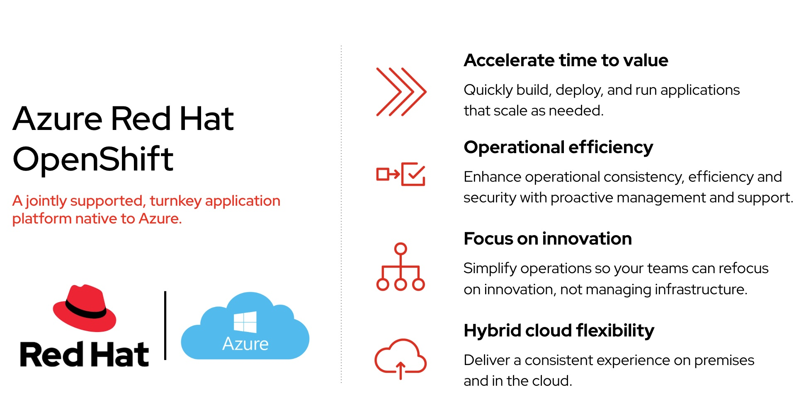

# Azure Red Hat Openshift ARO Public Links Document
#by Andrew Grimes, thsi is my own effort an unnofficial 
#These are links to help with documentation and resources for the joint Red Had and Microsoft Azure managed service based on OpenShift. 

Sample Backend App and Input Image: 

    
  <em> 
  </em>

**Azure and Red Hat Resources**
Azure ARO overview Video short
https://www.youtube.com/watch?v=H6PTZ6OXjkE

Azure ARO Workloads (AI, Cloud Pak(s), NVIDIA) 
https://www.youtube.com/watch?v=jdMwmWiMOFU

Azure ARO overview Video
https://www.youtube.com/watch?v=OQuikb8VcTY

Azure Red Hat OpenShift Refreshed Deck 2024 (internal) 
https://docs.google.com/presentation/d/1J9ycw3u2Xo8PdUOMu0eLxSxzUuKPNP-GiM0uBUbyIQA/edit#slide=id.p1

ARO RHPDS Demo: (internal) https://demo.redhat.com/catalog?item=babylon-catalog-prod/azure-gpte.open-environment-aro4-sub.prod&utm_source=webapp&utm_medium=share-link

**ARO Azure Resources **

Internal Red Hat Resource page (internal link) 
https://content.redhat.com/us/en/sales-enablement/sales-plays-overview/salesplay-openshift/salestactic-openshift-cloud-services.html#tabs-91412d45a3-item-53952adf7c-tab

ARO Public Pricing 
https://azure.microsoft.com/en-us/pricing/details/openshift/

ARO Pricing Calculator
https://azure.microsoft.com/en-us/pricing/calculator/
https://azure.microsoft.com/en-us/pricing/details/openshift/

Public Microsoft ARO References (Microsoft site) 
https://customers.microsoft.com/en-us/search?sq=%22Azure%20red%20hat%20openshift%22&ff=&p=2&so=story_publish_date%20desc

Ortec Finance ARO Reference (Microsoft site) 
https://customers.microsoft.com/en-us/story/1485727667262024367-ortec-finance-cloud-native-platform-azure-red-hat-openshift

ARO Azure Documentation: 
https://learn.microsoft.com/en-us/azure/openshift/

Support Responsibilities: 
Customer Support Matrix: https://learn.microsoft.com/en-us/azure/openshift/responsibility-matrix

ARO Architecture: Azure Site
https://techcommunity.microsoft.com/t5/fasttrack-for-azure/azure-red-hat-openshift-reference-architecture-amp-reference/ba-p/3470115

ARO Network: Azure site
https://learn.microsoft.com/en-us/azure/openshift/concepts-networking

Specific ARO Reference (Microsoft site) 
https://customers.microsoft.com/en-us/story/1485727667262024367-ortec-finance-cloud-native-platform-azure-red-hat-openshift

Microsoft Self Paced ARO (Microsoft site) 
https://microsoft.github.io/aroworkshop/

Ansible with ARO deployment video
https://www.youtube.com/watch?v=d701iQ2v2J0

Ansible with ARO Github: 
https://github.com/rh-mobb/ansible-aro

ARO deployment Video
here is a quick, 4 min demo, of deploying an ARO cluster in the Azure portal: https://www.youtube.com/watch?v=iY66MONBfVQ&t=1s

**ARO Azure Integration **
Integrate ARO with Azure DevOps (Video) 
https://www.youtube.com/watch?v=ugmY5DdErJ4

ARO OpenAI Chatbot 
https://github.com/rcarrat-AI/aro-azureopenai-gitops
https://www.redhat.com/en/blog/gitops-action-building-and-deploying-ai-chatbots-azure-red-hat-openshift-azure-openai

Azure Red Hat OpenShift Video Series
https://www.youtube.com/watch?v=H6PTZ6OXjkE&list=PLaR6Rq6Z4IqcY-4O8VTy_a68uG_aXdxBK

OpenAI and ARO Video
https://build.microsoft.com/en-US/sessions/9fbf0ce1-fa0e-4976-9b83-2e4e69e39501
https://www.youtube.com/watch?v=4Ebw2LwNQOY

OpenAI and ARO with K8sGPT
https://medium.com/@somnath.2301/kubernetes-insights-elevating-kubernetes-health-analysis-in-azure-red-hat-openshift-with-1b5efc3cc53a

ChatOps on ARO with OpenAI
https://meatybytes.io/posts/openshift/ocp-features/ai-ml/chatops/

Azure AI and ARO reference
https://customers.microsoft.com/en-ca/story/1772332670120262733-symend-azure-machine-learning-professional-services-en-canada

Azure ARO Compliance
https://azure.microsoft.com/mediahandler/files/resourcefiles/microsoft-azure-compliance-offerings/Microsoft%20Azure%20Compliance%20Offerings.pdf

Azure ARO Compliance
https://learn.microsoft.com/en-us/azure/azure-government/compliance/azure-services-in-fedramp-auditscope#terminology-used-1

**IBM Software on ARO **
IBM Maximo MAS
Maximo on ARO - Microsoft blog
https://learn.microsoft.com/en-us/azure/architecture/example-scenario/apps/deploy-ibm-maximo-application-suite

Maximo on ARO - Microsoft blog implementation 
https://techcommunity.microsoft.com/t5/azure-migration-and/ibm-maximo-application-suite-migration-and-modernization-with/ba-p/4123838#:~:text=MAS%20provides%20organizations%20with%20a,deploying%2C%20running%20and%20managing%20applications.

Maximon on ARO IBM blog
https://community.ibm.com/community/user/asset-facilities/blogs/sudhir-jain/2023/12/01/mas-on-aro

Maximo on Azure (self managed OCP) Listing 
https://azuremarketplace.microsoft.com/en-us/marketplace/apps/ibm-usa-ny-armonk-hq-6275750-ibmcloud-asperia.ibm_maximo_application_suite_client_managed?tab=Overview

Supported cluster sizes:
* Small: Master Nodes (Standard_D8s_v3 x 3) - vCPU:24 Memory:96GB | Worker Nodes (Standard_D16s_v3 x 3) - vCPU:48 Memory:192GB | Bootnode (Standard_D2s_v3 x 1) - vCPU:2 Memory:8GB
* Medium: Master Nodes (Standard_D8s_v3 x 3) - vCPU:24 Memory:96GB | Worker Nodes (Standard_D16s_v3 x 5) - vCPU:80 Memory:320GB | Bootnode (Standard_D2s_v3 x 1) - vCPU:2 Memory:8GB
* Large: Master Nodes (Standard_D8s_v3 x 5) - vCPU:40 Memory:160GB | Worker Nodes (Standard_D16s_v3 x 7) - vCPU:112 Memory:448GB | Bootnode (Standard_D2s_v3 x 1) - vCPU:2 Memory:8GB

Maximo on ARO Quick Azure Documentation 
https://learn.microsoft.com/en-us/azure/architecture/example-scenario/apps/deploy-ibm-maximo-application-suite

Maximo on ARO MSFT Blog
https://techcommunity.microsoft.com/t5/azure-migration-and/ibm-maximo-application-suite-migration-and-modernization-with/ba-p/4123838

Maximo on Air Gapped ARO (air gapped ARO) 
https://community.ibm.com/community/user/asset-facilities/blogs/saurabh-rajguru/2024/02/27/mas-on-private-aro

Install Maximo on ARO including an Ansible Playbook (blog) https://community.ibm.com/community/user/asset-facilities/blogs/sudhir-jain/2023/12/01/mas-on-aro

Install Maximo on IBM Cloud (OCP) Video
https://www.youtube.com/watch?v=jdcJA7kDacI

IBM Tririga on ARO
https://azuremarketplace.microsoft.com/en-us/marketplace/apps/aad.ibmtririgaoncloud?tab=Overview

IBM Watsonx 
Watsonx.ai on ARO (Blog) Microsoft 
https://www.ibm.com/blog/announcement/watsonx-on-microsoft-azure/

Watsonx.ai on ARO (blog)  IBM
https://developer.ibm.com/articles/awb-introducing-watsonx-ai-on-microsoft-azure/

IBM Watsonx.governance on ARO reference architecture
https://developer.ibm.com/articles/awb-watsonx-governance-responsible-transparent-explainable-ai/

IBM Watsonx.governance on Azure Marketplace
https://azuremarketplace.microsoft.com/en-us/marketplace/apps/ibm-usa-ny-armonk-hq-6275750-ibmcloud-asperia.watsonx-governance-ibm?tab=Overview&utm_source=ibm_developer&utm_content=in_content_link

IBM CP4I 
CP4I on Azure with ARO
Blog:https://techcommunity.microsoft.com/t5/apps-on-azure-blog/ibm-cloud-pak-for-integration-on-azure-red-hat-openshift-now/ba-p/4180542

CP4I on Azure with ARO Marketplace:https://azuremarketplace.microsoft.com/en-us/marketplace/apps/ibm-usa-ny-armonk-hq-6275750-ibmcloud-asperia.ibm-cloud-pak-for-integration-aro-byol?tab=Overview

CP4I on ARO POC (dated)
https://rastogianshul85.medium.com/cp4i-part2-proof-of-concept-poc-learn-share-a756ca0f084f
https://rastogianshul85.medium.com/ibm-cloud-paks-for-integration-aka-cp4i-learni-part1-dffd71f7a739

IBM CP4D
CP4D on ARO Marketplace Listing
https://azuremarketplace.microsoft.com/en-us/marketplace/apps/ibm-usa-ny-armonk-hq-6275750-ibmcloud-asperia.cloud-pak-for-data-ibm?tab=overview

IBM LIberty
IBM Liberty on ARO IBM Documentation
https://www.ibm.com/docs/en/was-liberty/core?topic=container-running-websphere-liberty-microsoft-azure

IBM Liberty on ARO Azure  Documentation
https://learn.microsoft.com/en-us/azure/openshift/howto-deploy-java-liberty-app

IBM Liberty ARO listing Marketplace Listing https://azuremarketplace.microsoft.com/en-us/marketplace/apps/ibm-usa-ny-armonk-hq-6275750-ibmcloud-aiops.20210823-liberty-aro?tab=overview

IBM Governance on ARO Marketplace listing 
https://azuremarketplace.microsoft.com/en-us/marketplace/apps/ibm-usa-ny-armonk-hq-6275750-ibmcloud-asperia.ibm-data-governance-express-byol?tab=overview

IBM Guardium Insights on ARO
https://www.ibm.com/docs/en/guardium-insights/3.2.x?topic=scenarios-manual-installation-azure-aro

IBM Cloud Pak for Business Automation on ARO  CP4BA 
https://www.ibm.com/docs/en/cloud-paks/cp-biz-automation/23.0.1?topic=automation-planning
https://github.com/apollo-business-automation/ibm-cp4ba-demo-deployment
https://www.ibm.com/docs/en/cloud-paks/cp-biz-automation/23.0.1?topic=automation-installing

M2M ARO Pricing Discount
https://docs.google.com/document/d/1T_DY3YTRVP5D6T9j4lK06bGzRyQ1unWb7mtV-R3di8o/edit

IBM Sterling on ARO
https://www.ibm.com/blog/announcement/introducing-ibm-sterling-order-management-on-microsoft-azure/

IBM Sterling OMS on ARO
Microsoft IBM Sterling OMS on ARO Documentation
https://learn.microsoft.com/en-us/azure/architecture/reference-architectures/ibm/deploy-ibm-sterling-oms

IBM Sterling OMS on ARO  Blog 
https://developer.ibm.com/tutorials/deploying-sterling-order-management-on-azure-red-hat-openshift/

IBM Sterling OMS on ARO Install Procedures 
https://github.com/Azure/sterling

IBM Support Matrix 
https://www.ibm.com/software/reports/compatibility/clarity/softwareReqsForProduct.html
https://www.ibm.com/support/pages/node/6592835

**Microsoft ARO Technical Resources**
Microsoft Support FAQ
https://docs.microsoft.com/en-us/azure/openshift/openshift-faq#how-do-i-handle-cluster-upgrades

Azure ARO lifecycles: 
https://docs.microsoft.com/en-us/azure/openshift/support-lifecycle

